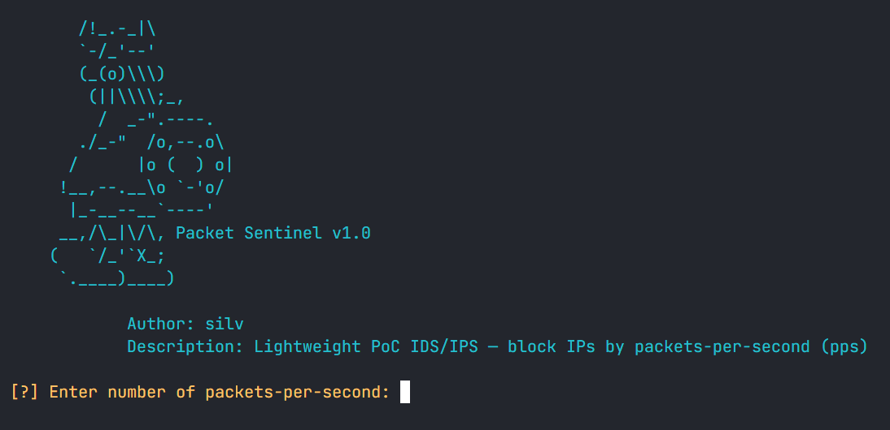

# PacketSentinel



**Lightweight PoC IDS/IPS — block IPs by packets-per-second (pps)**

## Overview

PacketSentinel is a proof-of-concept Python tool that demonstrates simple packet-rate based blocking. It uses Scapy to sniff IP traffic, computes per-source packet rates (packets/second). This project is intended for educational and lab use only.

> ⚠️ **Important:** This is a PoC — not production-ready. Use in controlled environments only.

## Features

- Sniffs IP traffic using **Scapy**.
- Counts packets per source IP over 1-second windows (configurable).
- Blocks offending IPs via `netsh` (Windows).
- Lightweight, easy to read and extend.

## Quick start

1. Install requirements:

```bash
pip install -r requirements
```

2. Run the code:

```bash
python main.py
```
